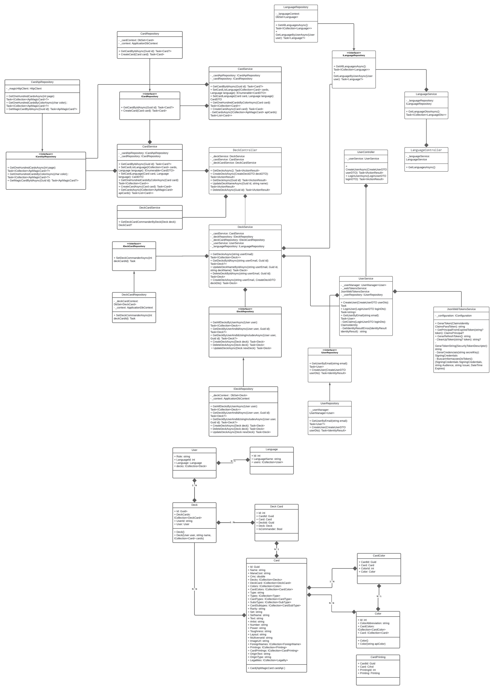

# Card Game

Card Game é uma web api que tem como objetivo gerar baralhos aleatórios através de um *commander*

## Diagrama de Classes

## Tecnologias utilizadas
- .NET
- Redis
- EF Core
- SQL Server
- Identity
- Autenticação OAuth 2.0 com JWT Tokens
- Autorização baseada em Roles

