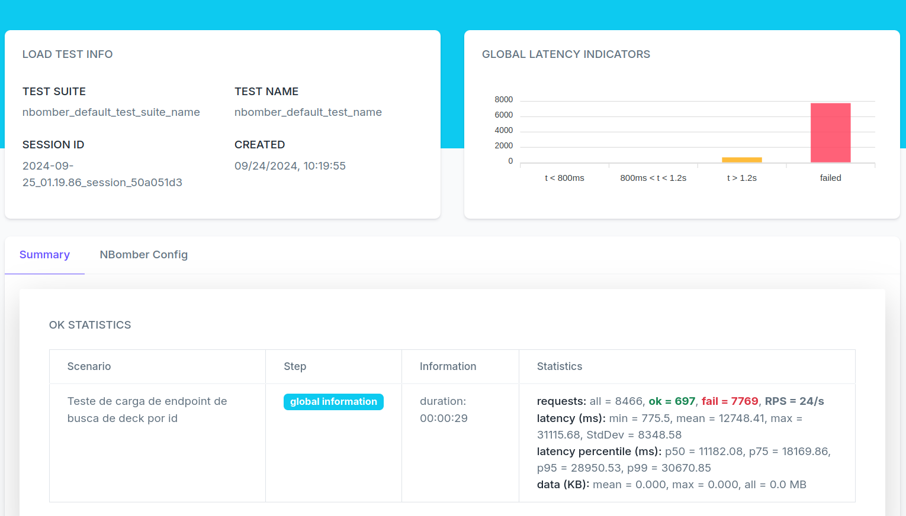
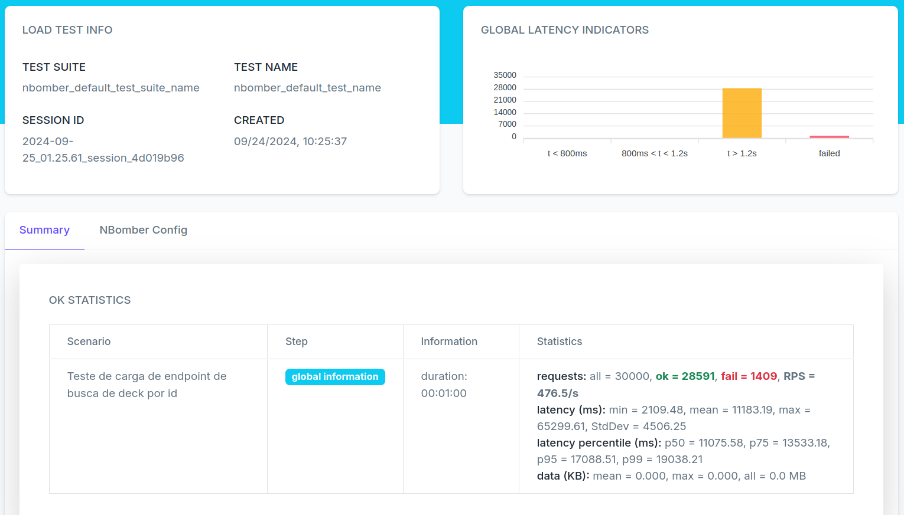

# Card Game

Card Game é uma web api que tem como objetivo gerar baralhos de magic de forma aleatórios através de um *commander*.

## Tecnologias utilizadas
- .NET
- EF Core => ORM para manipulação do banco
- Autenticação OAuth 2.0 com JWT Tokens
- Autorização baseada em Roles
- Identity => Autenticação e Autorização de usuarios
- Fluent Validation => Validação de entrada de dados
- XUnit => Biblioteca de Testes
- NSubstitute => Mock de classes para testes
- Redis => Banco de Cache
- SQL Server => Banco de Dados Relacional
- NBomber => Teste de Carga
- Swagger => Documentação da API

## Diagrama de Classes

## Cache
Um ponto muito interessante de se observar é a performance da api em um comparativo com cache e sem cache
A api sem cache foi capaz de receber aproximadamente 8500 requisições no periodo de 1 minuto, sendo que menos de 10% dessas requisições de fato foram antendidas.
Porem quando utilizamos o cache como ferramente de otimização, a api foi capaz de atender 30 mil requisições no periodo de 1 minuto, sendo que que 95% dessas requisições foram atendidas.
Estarei deixando a baixo a referência gerada pelo NBomber durante o teste de carga

## Como Rodar
- 1 Clone o projeto na sua maquina
- 2 Certifique-se que possui "docker" e "docker compose" instalados
- 3 Na pasta base do projeto, digite "docker compose up -d"
- 4 O swagger estará disponivel em [http://localhost:8080/swagger/index.html)](http://localhost:8080/swagger/index.html)

